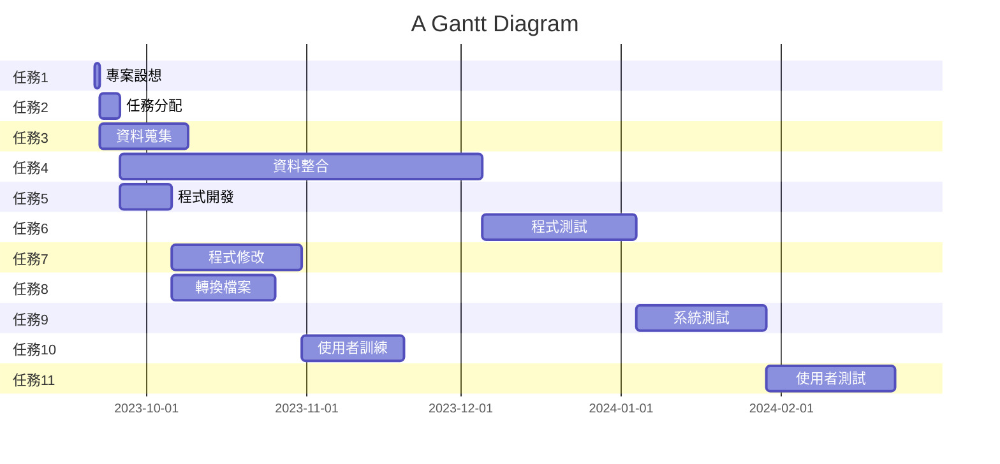

# Group_12 第12組
## 專題名稱:AI員工臉部打卡辨識系統

## 小組成員:
#### *C110118221 陳俊儒*
#### C110118240 張凱宸
#### C110118244 陳力銓
#### C110118227 黃逸堃
## 工作分配:
| 姓名 | 工作內容 |
| :-: | :-: |
| 陳俊儒 | 專案設想、分配工作、資料蒐集|
| 黃逸堃 | 資料蒐集、資料整合、程式開發 |
| 陳力銓 | 程式開發、程式修改、使用者訓練、使用者測試 |
| 張凱宸 | 轉換檔案、系統測試、使用者訓練、使用者測試  |

## 專題簡介: 在這個人工智慧的技術已發展趨近成熟的現代,人工智慧的應用可說是相當的廣泛。如果我們可以利用鏡頭搭配人工智慧,讓電腦處裡動態影像,並分辨出員工臉部進行上下班打卡,再結合保全系統,讓沒有登記的訪客無法進入室內公共場所，並通知警衛到場處理。

# 甘特圖

# pert 圖

# 關鍵路徑
1 -> 2 -> 4 -> 6 -> 9 -> 11

# 至少各三項的功能性需求與非功能性需求
1. 功能性需求：
* 偵測：
* 辨識：
* ：用戶能夠編輯現有的請購單，修改相應的資料。
* 刪除請購單（Delete）：用戶能夠刪除現有的請購單。

2. 非功能性需求：
* 直觀性：用戶界面應該是直觀的，用戶能夠輕易理解如何使用系統。
* 可用性：系统是可用的，保證高可靠性和穩定性。
* 可擴展性：系统应该能够容易地扩展，以适应未来的需求变化。
* 實時性：對於數據更新的操作，能夠提供及时的反饋和數據更新。
* 一致性：數據在前端和後端之間保持一致，確保操作的正確性。

