# Group_12 第12組
## 專題名稱:AI員工臉部辨識打卡系統

## 小組成員:
#### *C110118221 陳俊儒*
#### C110118240 張凱宸
#### C110118244 陳力銓
#### C110118227 黃逸堃
## 工作分配:
| 姓名 | 工作內容 |
| :-: | :-: |
| 陳俊儒 | 專案設想、分配工作、資料蒐集|
| 黃逸堃 | 資料蒐集、資料整合、程式開發 |
| 陳力銓 | 程式開發、程式修改、使用者訓練、使用者測試 |
| 張凱宸 | 轉換檔案、系統測試、使用者訓練、使用者測試  |

## 專題簡介: 在這個人工智慧的技術已發展趨近成熟的現代,人工智慧的應用可說是相當的廣泛。我們可以利用鏡頭搭配人工智慧,讓電腦處裡動態影像,並分辨出員工臉部進行上下班打卡,再結合保全系統,讓沒有登記的訪客無法進入室內公共場所，並通知警衛到場處理。

# 甘特圖
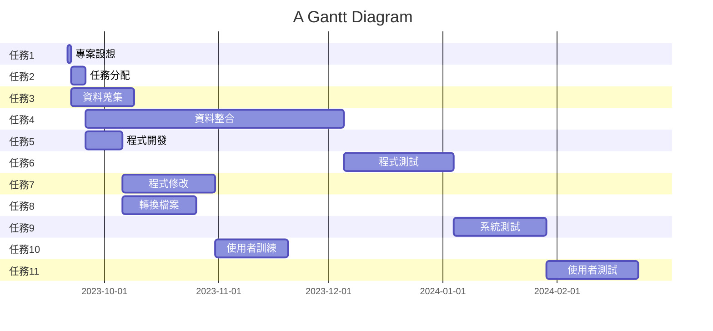

# pert 圖

# 關鍵路徑
1 -> 2 -> 4 -> 6 -> 9 -> 11

# 功能性需求與非功能性需求
| 功能性需求 |  |
| :-: | :-: |
| 1.用戶管理 | 管理員能夠添加、刪除和編輯員工的資料以及管理權限。|
| 2.臉部識別 | 系統必須準確識別員工的臉部特徵以驗證其身份。 |
| 3.考勤報告 | 系通應該記錄員工的出勤和離開時間，以便生成考勤報告。 |

| 非功能性需求 |  |
| :-: | :-: |
| 1.辨識精準度 | 減少臉部辨識的誤差和不準確的考勤紀錄。|
| 2.適應性 | 系統必須適應不同光線、角度和臉部表情下的臉部識別。 |
| 3.可用性 | 系統應具備高度可用性，以確保員工在需要時方便的打卡。 |

# 功能分解圖(functional decomposition diagram, FDD)
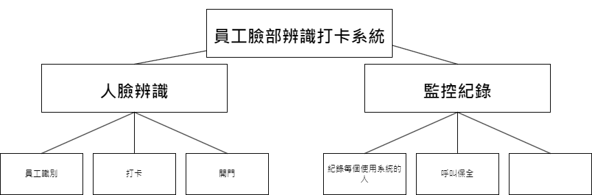

# 需求分析的描述
|AI員工臉部辨識打卡系統的需求分析簡述|
|:-----|
|1. 管理者需有所有員工的臉部照片來使用系統。|
|2. 管理者能夠添加、刪除和編輯員工的資料以及管理權限。|
|3. 管理者能使用缺勤功能，來檢視員工的出缺勤狀況。|
|4. 員工打卡完後能確認自己的出缺勤狀況。|

# 使用案例圖
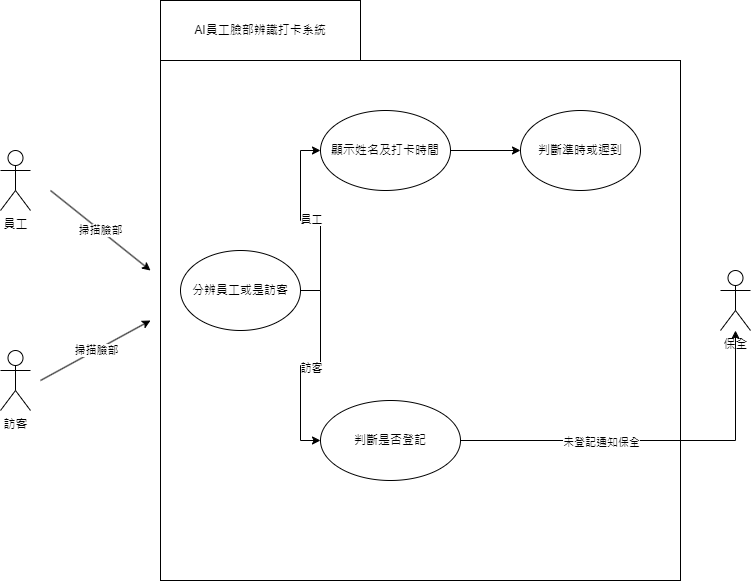
# 使用案例1說明
|使用案例1|員工打卡|
|:---------:|:-------:|
|行動者|內部員工|
|說明|掃描人臉並打卡|
|完成動作|1.掃描人臉 2.顯示名字及打卡時間 3.判斷是否準時|
|替代方法|1.到公司打卡機前 2.用員工證進行打卡 3.判斷是否準時|
|先決條件|1.必須是公司內部員工 2.臉部不可跟註冊faceid時有明顯的變化|
|後置條件|員工可進入公司並打卡|
|假設|無|
# 使用案例2說明
|使用案例2|訪客來訪|
|:---------:|:-------:|
|行動者|外部人員|
|說明|掃描人臉並打卡|
|完成動作|1.掃描人臉 2.顯示訪客及到訪時間 3.判斷是否登記|
|替代方法|1.到公司服務處前 2.跟服務人員說明是訪客 3.由服務人員處理到訪業務|
|先決條件|1.必須是外部人員 2.登記時需先提供個人照片，使AI能判斷是否為已登記的訪客|
|後置條件|訪客可進入公司處理業務|
|假設|無|
# 使用Figma劃出第一個使用案例的動態模擬畫面
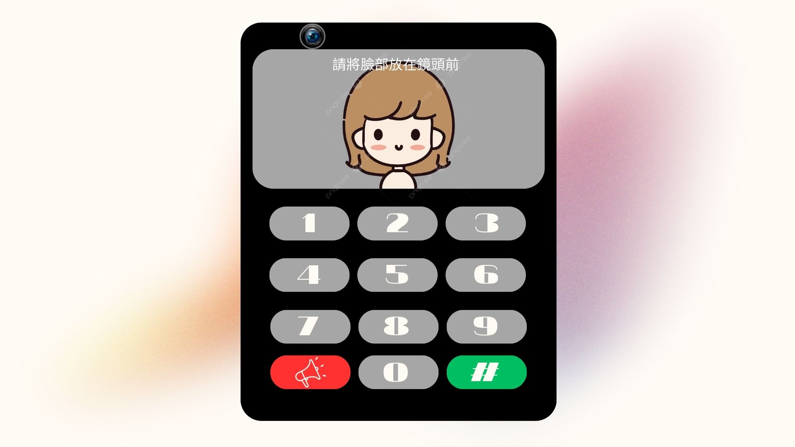

# 系統環境圖DFD
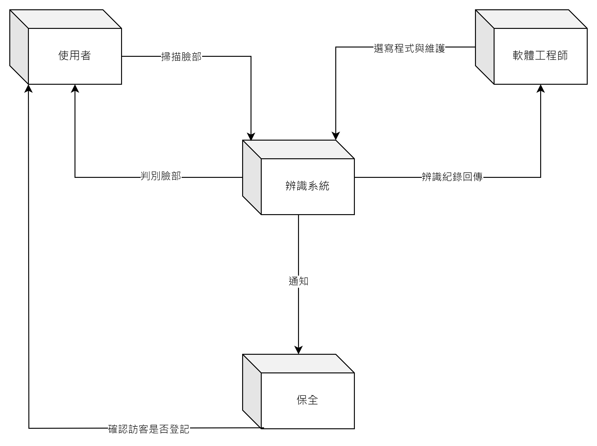
# 系統環境圖DFD圖0
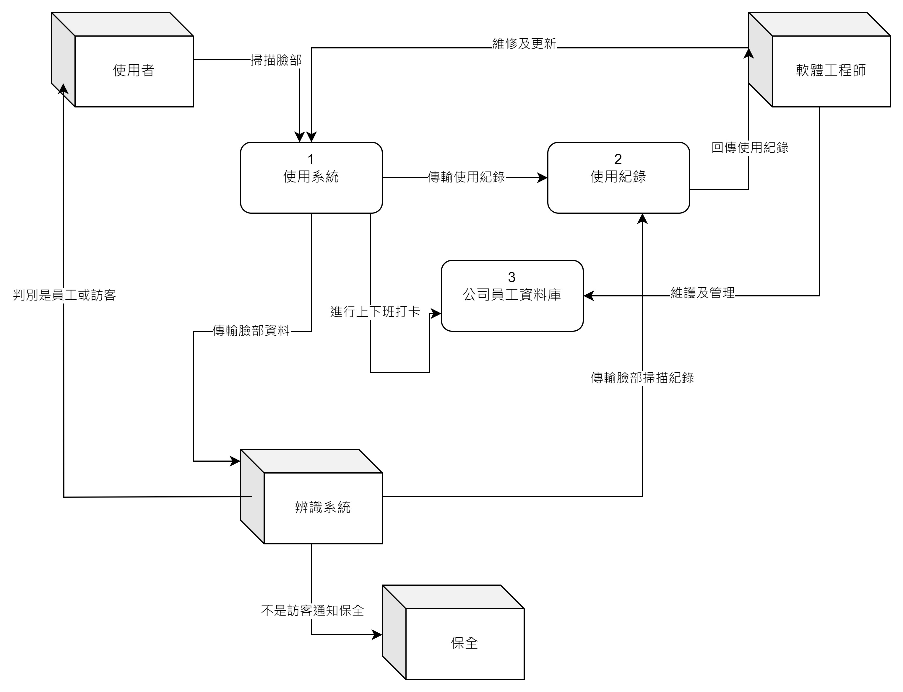
### UML類別圖(CLASS DIAGRAM)
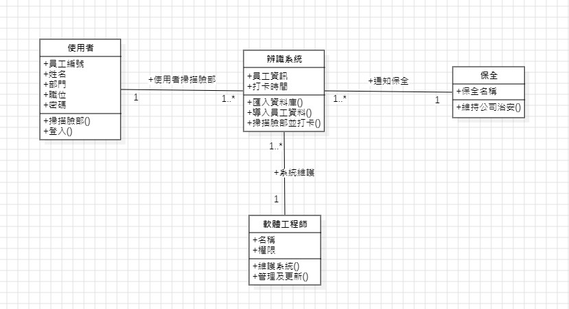

---

## 使用案例一:員工進入公司
### 繪製循序圖
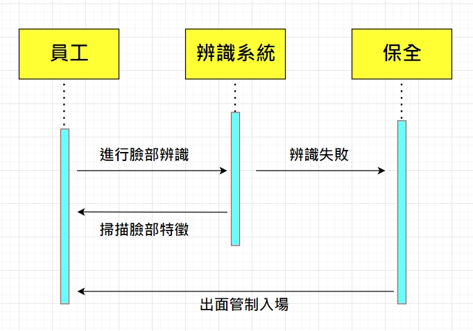
### 活動圖
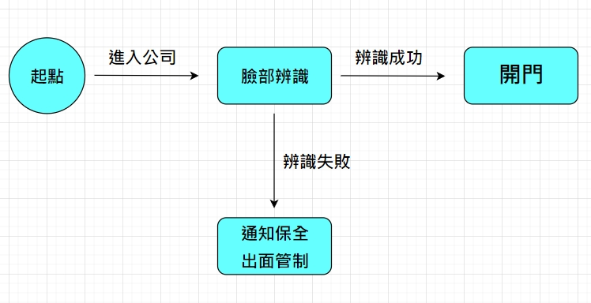

---
## 使用案例二:
### 繪製循序圖
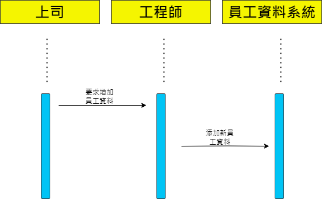
### 活動圖
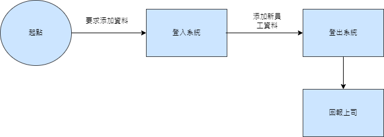

---
## 使用案例三:
### 繪製循序圖
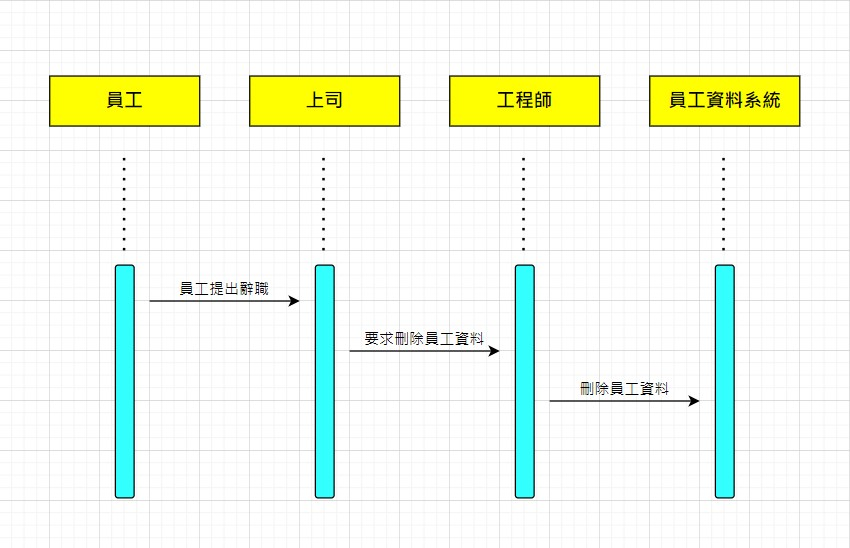
### 活動圖
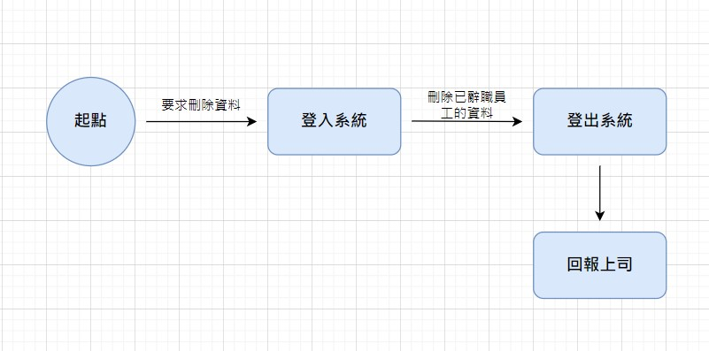

***
### 分鏡表
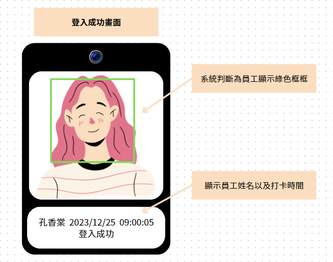

***
### 實體關係圖(entity-relationship diagram, ERD)
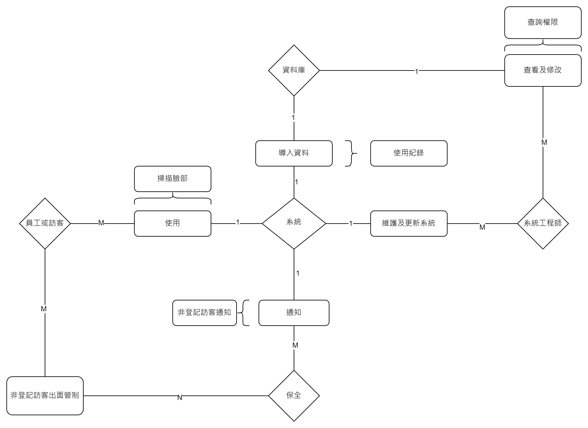
