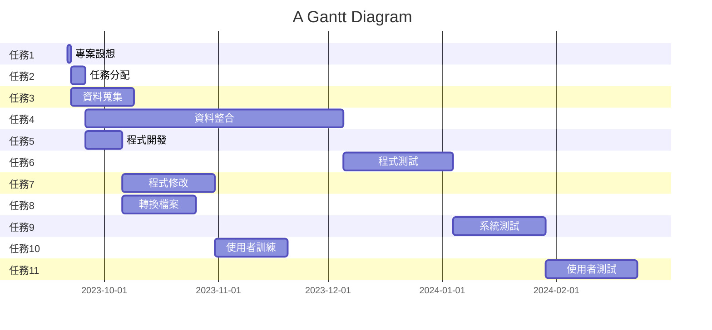

# Group_12 第12組
## 專題名稱:AI員工臉部打卡辨識系統

## 小組成員:
#### *C110118221 陳俊儒*
#### C110118240 張凱宸
#### C110118244 陳力銓
#### C110118227 黃逸堃
## 工作分配:
| 姓名 | 工作內容 |
| :-: | :-: |
| 陳俊儒 | 專案設想、分配工作、資料蒐集|
| 黃逸堃 | 資料蒐集、資料整合、程式開發 |
| 陳力銓 | 程式開發、程式修改、使用者訓練、使用者測試 |
| 張凱宸 | 轉換檔案、系統測試、使用者訓練、使用者測試  |

## 專題簡介: 在這個人工智慧的技術已發展趨近成熟的現代,人工智慧的應用可說是相當的廣泛。如果我們可以利用鏡頭搭配人工智慧,讓電腦處裡動態影像,並分辨出員工臉部進行上下班打卡,再結合保全系統,讓沒有登記的訪客無法進入室內公共場所，並通知警衛到場處理。

# 甘特圖

# pert 圖

# 關鍵路徑
1 -> 2 -> 4 -> 6 -> 9 -> 11

# 至少各三項的功能性需求與非功能性需求
1. 功能性需求：
* 人臉辨識功能：能夠識別和辨識已註冊的員工的人臉，確保只有授權的人可以進入特定區域或執行特定操作。
* 註冊和管理功能：提供註冊新員工的方式，以及管理和更新現有員工的身份資訊，如照片、姓名、部門等。
* 存取控制：確保只有授權的員工能夠進入特定區域或執行特定工作，並根據需要實施不同級別的權限。
* 監控和記錄功能：記錄員工進出記錄，以便跟踪活動、安全事件或安全違規。
* 故障恢復和冗餘性：具有系統故障恢復機制，以確保在系統故障時繼續提供安全存取。

2. 非功能性需求：
* 安全性：保障敏感個人資訊和生物特徵數據的安全性，包括身份識別資訊的加密和存儲安全性。
* 可用性：確保系統在需要時可用，避免長時間的停機，以確保員工的順利出入和使用。
* 適應性：能夠應對不同環境條件下的辨識需求，如光線、角度和遮擋。
* 法規遵循：需符合相關法律法規和隱私規定，以保護個人隱私和數據使用權。
* 可維護性：系統需要易於維護，包括升級和更新，以確保長期運行的穩定性。
* 互操作性：能夠與其他相關系統和設備互相協作，以實現更大的整合性和功能性。
* 可擴展性：具有能夠支持未來生物特徵辨識技術和其他相關技術的能力，以應對不斷變化的需求。
* 故障恢復和容錯能力：系統應具有自動恢復功能，以應對硬體或軟體故障情況。
